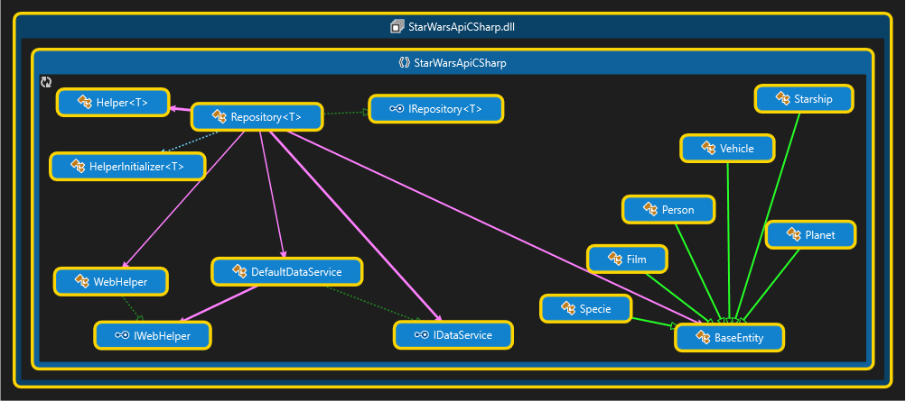

# SWapi-CSharp
#### Helper library for consuming data from http://swapi.co/

[](https://ci.appveyor.com/project/M-Yankov/swapi-csharp/branch/master)
[](https://coveralls.io/github/M-Yankov/SWapi-CSharp?branch=master)

### Install

* Install from [Nuget](https://www.nuget.org/packages/SWapiCSharp/) using the command in package manager console:

    PM> `Install-Package SWapiCSharp`

### Entities

* `Film`
    * `string` Title
    * `string` EpisodeId
    * `string` OpeningCrawl
    * `string` Director
    * `string` Producer
    * `string` ReleaseDate
    * `ICollection<string>` Species
    * `ICollection<string>` Starships
    * `ICollection<string>` Vehicles
    * `ICollection<string>` Characters
    * `ICollection<string>` Planets

* `Pesron`
  * `string` Name 
  * `string` BirthYear 
  * `string` EyeColor 
  * `string` Gender
  * `string` HairColo
  * `string` Height
  * `string` Mass
  * `string` SkinColor 
  * `string` Homeworld
  * `ICollection<string>` Films
  * `ICollection<string>` Species 
  * `ICollection<string>` Starships 
  * `ICollection<string>` Vehicles

* `Planet`
    * `string` Name
    * `string` Diameter
    * `string` RotationPeriod
    * `string` OrbitalPeriod
    * `string` Gravity
    * `string` Climate
    * `string` Terrain
    * `string` SurfaceWater
    * `ICollection<string>` Residents
    * `ICollection<string>` Films

* `Specie`
    * `string` Name
    * `string` Classification
    * `string` Designation
    * `string` AverageHeight
    * `string` AverageLifespan
    * `string` EyeColors
    * `string` HairColors
    * `string` SkinColors
    * `string` Language
    * `string` Homeworld
    * `ICollection<string>` People
    * `ICollection<string>` Films

* `Starship`
    * `string` Name
    * `string` Model
    * `string` StarshipClass
    * `string` Manufacturer
    * `string` CostInCredits
    * `string` Length
    * `string` Crew
    * `string` Passengers
    * `string` MaxAtmospheringSpeed
    * `string` HyperdriveRating
    * `string` MegaLights
    * `string` CargoCapacity
    * `string` Consumables
    * `ICollection<string>` Films
    * `ICollection<string>` Pilots

* `Vehicle`
    * `string` Name
    * `string` Model
    * `string` VehicleClass
    * `string` Manufacturer
    * `string` Length
    * `string` CostInCredits
    * `string` Crew
    * `string` Passengers
    * `string` MaxAtmospheringSpeed
    * `string` CargoCapacity
    * `string` Consumables
    * `ICollection<string>` Films
    * `ICollection<string>` Pilots

All of entities inherits `BaseEntity` class which has following properties:

* `string` Url
* `DateTime` Created
* `DateTime` Edited

So after you have an instance of one entity type, you can get his base properties:
```c#
Console.WriteLine(person.Created);
```

<a href="./Structure.png">
    
</a>
### Examples

Using  `Repository<T>` class:

```c#

IRepository<Starship> starshipRepo = new Repository<Starship>();
// The Starship class can be replaced with each other entity class: Person, Specie, Film, Vehicle or Planet.

```

The repository has two main methods for consume entities:

1. `GetById(int id)`

    If the entity with passed `id` doesn't exist, repository will return null.

    ```c#
    Starship starshipDetails = starshipRepo.GetById(3);

    // Allays check for null!!!
    if(starshipDetails != null)
    {
        Console.WriteLine(starship.Name);
    }

    // C# 6.0 syntax
    Console.WriteLine(starship?.Name);
    ```

    The `Vehicle` has collection of `Films`, but it's only URLs. So to access them you should manually done this:
    ```c#
    Vehicle vehicle = vehicleRepository.GetById(2);

    if (vehicle != null && vehicle.Films.Count > 0)
    {
        Console.WriteLine("Vehicle {0} has {1} films:", vehicle.Name, vehicle.Films.Count);
        foreach (var film in vehicle.Films)
        {
            // GetFilmId is a helper method just for extracting the id from the url. Example: http://swapi.co/api/films/2/ - will return only 2.
            int filmId = this.GetFilmId(film);
        
            // getting related items should be done manual
            Film relatedFilm = filmRepository.GetById(filmId);
            Console.WriteLine(relatedFilm.Title);
        }
    }    
    ```

    Sometimes a property from entity can return **`unknown`** or **`n/a`** as a value. So be careful when parsing properties to other type. 
    There are many ways to validate it: 

    ```c#
    Specie specie = specieRepository.GetById(5);
    int SpecialSpan = 2;

    // Check for specie != null { ... }

    if (specie.AverageLifespan != "unknown")
    {
        int lifeSpan = int.Parse(specie.AverageLifespan);
        Console.WriteLine("Life span: " + (lifeSpan + SpecialSpan));
    }

    int lifeSpanAverage = 0;
    if (int.TryParse(specie.AverageLifespan, out lifeSpanAverage))
    {
        // If parse is success, lifeSpanAverage will have parsed value.
        Console.WriteLine("Life span: " + (lifeSpanAverage + SpecialSpan));
    }
    ```


1. `GetEntities(int page = 1, int size = 10)`

    By default size is from http://swapi.co/api is 10. 
    You can pass the page and size for getting entities, but you should know that if you want size 20 and page 3 it will start from 3-rd page and will collect entities from next pages until size is reached or next page is `null`.
    So all pages have 10 entities and with parameters above, the method will return entities on page 3 and 4.

    Example with first five entities from second page:

    ```c#
    var plnetsRepository = new Repository<Planet>();

    var planets = plnetsRepository.GetEntities(2, 5);

    if (planets == null)
    {
        Console.WriteLine("There are no planets on page {0}", page);
        return;
    }

    foreach (var planet in planets)
    {
        Console.WriteLine("Name: " + planet.Name);
        Console.WriteLine("Terrain: " + planet.Terrain);
    }
    ```

    If you call `GetEntities` without passing values, the method will return first ten entities from type in first page.

    To get all entities from type:
    ```c#
    var films = filmsRepo.GetEntities(size: int.MaxValue);    
    ```

1. Extending Entities:

    Make a class which inherits the entity type to extend for example person.
    ```C#
    public class MyPerson : Person
    {
        public override string ToString()
        {
            return this.Name + Environment.NewLine +
                "Birth year: " + this.BirthYear + Environment.NewLine +
                "Has " + this.Starships.Count + " starships"; 
        }
    }
    ```

    After that you can make a repository from `MyPerson`:
    ```c#
    IRepository<MyPerson> peopleRepo = new Repository<MyPerson>();
    MyPerson kenobi = peopleRepo.GetById(10);
    Console.WriteLine(kenobi.ToString());
    
    /***** Will print:

    Obi-Wan Kenobi
    Birth year: 57BBY
    Has 5 starships 
        */
    ```

All of the examples can be seen in the repository [`Example`](/Example) project.

Full documentation about http://swapi.co/ [Documentation](http://swapi.co/documentation)

If you find a bug or something doesn't working [Submit here](https://github.com/M-Yankov/SWapi-CSharp/issues) 

